# EZ-PD™ PMG1 MCU: USBFS to UART using DMA

This code example demonstrates the data transfer between USBFS and UART peripherals using DMA. The USBFS block will be configured as a USB Communications Device Class (CDC). The data received via the USB OUT endpoint will be transferred using DMA to the UART TX buffer. The UART Tx and UART Rx pins can be connected to do a loopback. The data received via the UART RX buffer is transferred to USB IN endpoint via DMA. This code example shows how to use DMA to transfer data between two peripherals.

[View this README on GitHub.](https://github.com/Infineon/mtb-example-pmg1-usbfs-uart-dma)

[Provide feedback on this code example.](https://cypress.co1.qualtrics.com/jfe/form/SV_1NTns53sK2yiljn?Q_EED=eyJVbmlxdWUgRG9jIElkIjoiQ0UyMzY5MDAiLCJTcGVjIE51bWJlciI6IjAwMi0zNjkwMCIsIkRvYyBUaXRsZSI6IkVaLVBE4oSiIFBNRzEgTUNVOiBVU0JGUyB0byBVQVJUIHVzaW5nIERNQSIsInJpZCI6InRhbmphIiwiRG9jIHZlcnNpb24iOiIxLjAuMCIsIkRvYyBMYW5ndWFnZSI6IkVuZ2xpc2giLCJEb2MgRGl2aXNpb24iOiJNQ0QiLCJEb2MgQlUiOiJXSVJFRCIsIkRvYyBGYW1pbHkiOiJUWVBFLUMifQ==)


## Requirements

- [ModusToolbox™ software](https://www.infineon.com/modustoolbox) v3.0 or later (tested with v3.0)
- Board support package (BSP) minimum required version: 4.0.0
- Programming language: C
- Associated parts: [EZ-PD&trade; PMG1-S3 MCU](https://www.infineon.com/cms/en/product/evaluation-boards/cy7113/)

## Supported toolchains (make variable 'TOOLCHAIN')

- GNU Arm® embedded compiler v10.3.1 (`GCC_ARM`) - Default value of `TOOLCHAIN`
- Arm&reg; compiler v6.16 (`ARM`)
- IAR C/C++ compiler v8.42.2 (`IAR`)

## Supported kits (make variable 'TARGET')

- [EZ-PD&trade; PMG1-S3 Prototyping Kit](https://www.infineon.com/CY7113) (`PMG1-CY7113`) – Default value of `TARGET`

## Hardware setup

1. Connect the EZ-PD&trade; PMG1 Prototyping Kit to your PC using a USB cable through the KitProg3 USB Type-C port (J1). This cable is used for programming the EZ-PD&trade; PMG1 device.
2. Connect the EZ-PD&trade; PMG1 USB PD sink port (J10) to your PC using a Type-C to Type-C/Type-A cable to power the EZ-PD&trade; PMG1 device for normal operation.
3. Connect a jumper across J7.6 to J7.7 to loop back the UART_Tx pin (P4[0]) to UART_Rx pin (P4[1]).

## Software setup

Install a terminal emulator if you don't have one. Instructions in this document use [Tera Term](https://ttssh2.osdn.jp/index.html.en).

## Using the code example

Create the project and open it using one of the following:

<details><summary><b>In Eclipse IDE for ModusToolbox&trade; software</b></summary>

1. Click the **New Application** link in the **Quick Panel** (or, use **File** > **New** > **ModusToolbox&trade; Application**). This launches the [Project Creator](https://www.infineon.com/ModusToolboxProjectCreator) tool.

2. Pick a kit supported by the code example from the list shown in the **Project Creator - Choose Board Support Package (BSP)** dialog.

   When you select a supported kit, the example is reconfigured automatically to work with the kit. To work with a different supported kit later, use the [Library Manager](https://www.infineon.com/ModusToolboxLibraryManager) to choose the BSP for the supported kit. You can use the Library Manager to select or update the BSP and firmware libraries used in this application. To access the Library Manager, click the link from the **Quick Panel**.

   You can also just start the application creation process again and select a different kit.

   If you want to use the application for a kit not listed here, you may need to update the source files. If the kit does not have the required resources, the application may not work.

3. In the **Project Creator - Select Application** dialog, choose the example by enabling the checkbox.

4. (Optional) Change the suggested **New Application Name**.

5. The **Application(s) Root Path** defaults to the Eclipse workspace which is usually the desired location for the application. If you want to store the application in a different location, you can change the *Application(s) Root Path* value. Applications that share libraries should be in the same root path.

6. Click **Create** to complete the application creation process.

For more details, see the [Eclipse IDE for ModusToolbox&trade; software user guide](https://www.infineon.com/MTBEclipseIDEUserGuide) (locally available at *{ModusToolbox&trade; software install directory}/docs_{version}/mt_ide_user_guide.pdf*).

</details>

<details><summary><b>In command-line interface (CLI)</b></summary>

ModusToolbox&trade; software provides the Project Creator as both a GUI tool and the command line tool, "project-creator-cli". The CLI tool can be used to create applications from a CLI terminal or from within batch files or shell scripts. This tool is available in the *{ModusToolbox&trade; software install directory}/tools_{version}/project-creator/* directory.

Use a CLI terminal to invoke the "project-creator-cli" tool. On Windows, use the command line "modus-shell" program provided in the ModusToolbox&trade; software installation instead of a standard Windows command-line application. This shell provides access to all ModusToolbox&trade; software tools. You can access it by typing `modus-shell` in the search box in the Windows menu. In Linux and macOS, you can use any terminal application.

The "project-creator-cli" tool has the following arguments:

Argument | Description | Required/optional
---------|-------------|-----------
`--board-id` | Defined in the `<id>` field of the [BSP](https://github.com/Infineon?q=bsp-manifest&type=&language=&sort=) manifest | Required
`--app-id`   | Defined in the `<id>` field of the [CE](https://github.com/Infineon?q=ce-manifest&type=&language=&sort=) manifest | Required
`--target-dir`| Specify the directory in which the application is to be created if you prefer not to use the default current working directory | Optional
`--user-app-name`| Specify the name of the application if you prefer to have a name other than the example's default name | Optional

<br>

The following example clones the "[Pmg1UsbfsUartDma](https://github.com/Infineon/mtb-example-pmg1-usbfs-uart-dma)" application with the desired name "Pmg1UsbfsUartDma" configured for the *PMG1-CY7113* BSP into the specified working directory, *C:/mtb_projects*:

   ```
   project-creator-cli --board-id PMG1-CY7113 --app-id mtb-example-pmg1-usbfs-uart-dma --user-app-name Pmg1UsbfsUartDma --target-dir "C:/mtb_projects"
   ```

**Note:** The project-creator-cli tool uses the `git clone` and `make getlibs` commands to fetch the repository and import the required libraries. For details, see the "Project creator tools" section of the [ModusToolbox&trade; software user guide](https://www.infineon.com/ModusToolboxUserGuide) (locally available at *{ModusToolbox&trade; software install directory}/docs_{version}/mtb_user_guide.pdf*).

To work with a different supported kit later, use the [Library Manager](https://www.infineon.com/ModusToolboxLibraryManager) to choose the BSP for the supported kit. You can invoke the Library Manager GUI tool from the terminal using `make library-manager` command or use the Library Manager CLI tool "library-manager-cli" to change the BSP.

The "library-manager-cli" tool has the following arguments:

Argument | Description | Required/optional
---------|-------------|-----------
`--add-bsp-name` | Name of the BSP that should be added to the application | Required
`--set-active-bsp` | Name of the BSP that should be as active BSP for the application | Required
`--add-bsp-version`| Specify the version of the BSP that should be added to the application if you do not wish to use the latest from manifest | Optional
`--add-bsp-location`| Specify the location of the BSP (local/shared) if you prefer to add the BSP in a shared path | Optional

<br />

The following example adds the PMG1-CY7113 BSP to the already created application and makes it the active BSP for the app:

   ```
   ~/ModusToolbox/tools_3.0/library-manager/library-manager-cli --project "C:/mtb_projects/Pmg1UsbfsUartDma" --add-bsp-name PMG1-CY7113--add-bsp-version "latest-v4.X" --add-bsp-location "local"

   ~/ModusToolbox/tools_3.0/library-manager/library-manager-cli --project "C:/mtb_projects/Pmg1UsbfsUartDma" --set-active-bsp APP_PMG1-CY7113

   ```


</details>

<details><summary><b>In third-party IDEs</b></summary>

Use one of the following options:

- **Use the standalone [Project Creator](https://www.infineon.com/ModusToolboxProjectCreator) tool:**

   1. Launch Project Creator from the Windows Start menu or from *{ModusToolbox&trade; software install directory}/tools_{version}/project-creator/project-creator.exe*.

   2. In the initial **Choose Board Support Package** screen, select the BSP, and click **Next**.

   3. In the **Select Application** screen, select the appropriate IDE from the **Target IDE** drop-down menu.

   4. Click **Create** and follow the instructions printed in the bottom pane to import or open the exported project in the respective IDE.

<br>

- **Use command-line interface (CLI):**

   1. Follow the instructions from the **In command-line interface (CLI)** section to create the application.

   2. Export the application to a supported IDE using the `make <ide>` command.

   3. Follow the instructions displayed in the terminal to create or import the application as an IDE project.

For a list of supported IDEs and more details, see the "Exporting to IDEs" section of the [ModusToolbox&trade; software user guide](https://www.infineon.com/ModusToolboxUserGuide) (locally available at *{ModusToolbox&trade; software install directory}/docs_{version}/mtb_user_guide.pdf*).

</details>


## Operation

1. Ensure that the steps listed in the [Hardware setup](#hardware-setup) section are complete.

2. Ensure that the jumper shunt on the power selection jumper (J5) is placed at positions 2-3 to enable programming.

3. Connect the board to your PC using the USB cable through the KitProg3 USB Type-C port (J1).

4. Program the board using one of the following:

   <details><summary><b>Using Eclipse IDE for ModusToolbox&trade; software</b></summary>

      1. Select the application project in the Project Explorer.

      2. In the **Quick Panel**, scroll down, and click **\<Application Name> Program (KitProg3_MiniProg4)**.
   </details>

   <details><summary><b>Using CLI</b></summary>

     From the terminal, execute the `make program` command to build and program the application using the default toolchain to the default target. The default toolchain is specified in the application's Makefile but you can override this value manually:
      ```
      make program TOOLCHAIN=<toolchain>
      ```

      Example:
      ```
      make program TOOLCHAIN=GCC_ARM
      ```
</details>

5. After programming the kit, disconnect the USB cable and change the position on the power selection jumper (J5) to 1-2 to power the kit through the EZ-PD&trade; PMG1 USB PD sink port (J10).

6. Connect the EZ-PD&trade; PMG1 kit to the PC using a USB cable through the EZ-PD&trade; PMG1 USB PD sink port (J10).

7. On the PC; verify that a new USB device is enumerated as a Virtual COM port.

**Figure 1. Device Manager - Virtual COM port**

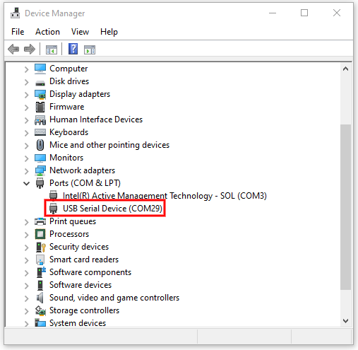

8. Run any of your terminal emulator programs and make a new connection to the virtual COM port.

9. Type any message in multiples of eight characters in the terminal and observe these characters echoing back to the window. Note that the characters are sent back to the terminal after the UART Rx FIFO has received eight characters.

Additionally, note that the Tera Term is a terminal that sends characters out as they are received and does not require you to press **Enter** to send messages. Therefore, characters are sent individually rather than sentences at a time. Other terminal applications will not send any characters out until **Enter** is pressed.


**Figure 2. Echo response from the terminal**

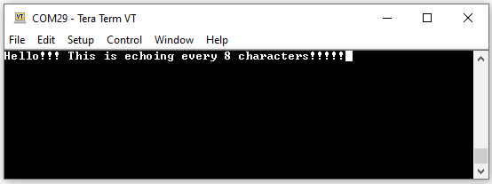

## Debugging

You can debug the example to step through the code. In the IDE, use the **\<Application Name> Debug (KitProg3_MiniProg4)** configuration in the **Quick Panel**. For details, see the "Program and debug" section in the [Eclipse IDE for ModusToolbox&trade; software user guide](https://www.infineon.com/MTBEclipseIDEUserGuide).


## Design and implementation
This application uses four DMA channels to demonstrate data transfer from peripheral to peripheral. In the case of this code example, it is DMA data transfer from USBFS peripheral to UART peripheral and vice versa. Each direction takes two DMA channels resulting in a total of four DMA channels. This is because it is not possible to directly connect USB to UART (peripheral to peripheral) using a single DMA channel. 

Therefore for each data transfer direction, one DMA channel connects the USB peripheral to the user SRAM, and another DMA channel connects the user SRAM to UART peripheral and vice versa. See Figure 3.

**Figure 3. Data transfer block diagram**

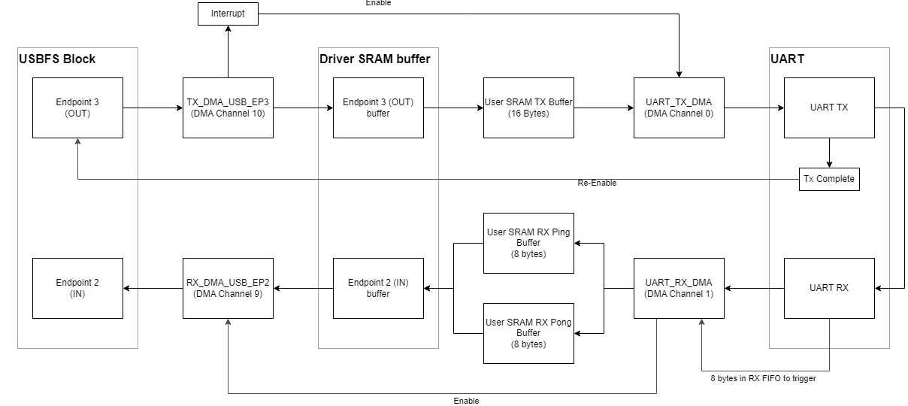

### Device configuration

1. Select the application project in Project Explorer.

2. In the **Quick Panel**, navigate to the **Tools** section, and click **Device Configurator 4.0**.

3. After the Device Configurator opens, navigate to the **Peripherals** tab. Select the **Universal Serial Bus (USB) 0** from the Communication Peripheral to edit the USB configuration fields. Note that the USB Peripheral personality is set as **USBFS Device-1.0**.

**Figure 4. Universal Serial Bus (USB) 0 configuration using Device Configurator**

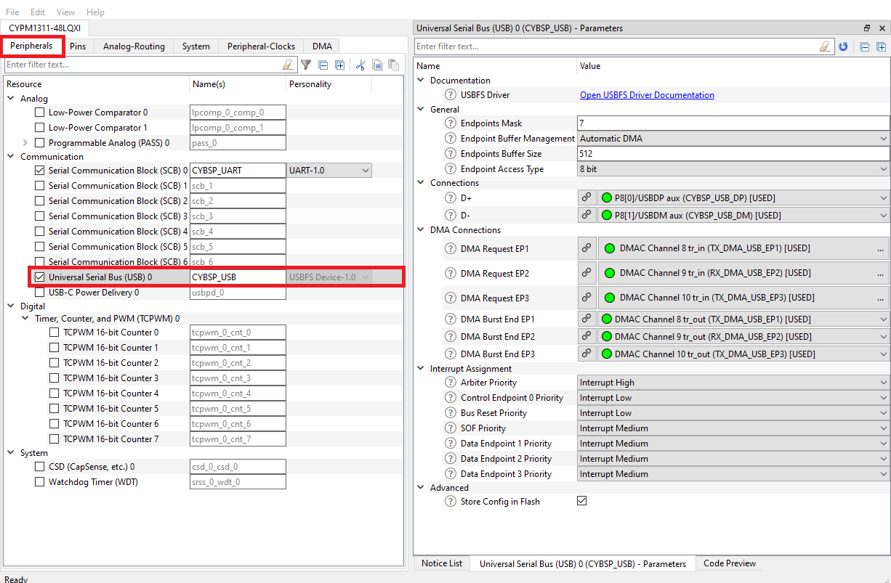

4. Observe the parameters for the Endpoints within the configuration fields of the USB Peripheral. Here the parameter **Endpoint Buffer Management** is set to **Automatic DMA**.

   DMA handles the data transfers between the driver SRAM buffers and the USBFS block hardware buffer, as shown in Figure 5. After data is in the driver SRAM buffer, an API can be called to move data from this buffer to any specified user SRAM buffer.

   When USB transfer starts, the USB block automatically generates DMA requests to transfer data between the USB block hardware buffer and the driver endpoint buffer until the transfer completes. The USB block also has feedback with the DMA channel in which the USB block will not issue new DMA requests until the previous data transfer has finished. These DMA requests and feedback lines are shown in the Parameters under **DMA Connections** labeled as DMA Request and DMA Burst End. Displayed endpoints for DMA connection are determined by the parameter **Endpoints Mask**. Here the application is set to 7 to display the Request and Burst End connections of EP1, EP2, and EP3.

**Figure 5. Automatic DMA mode diagram**

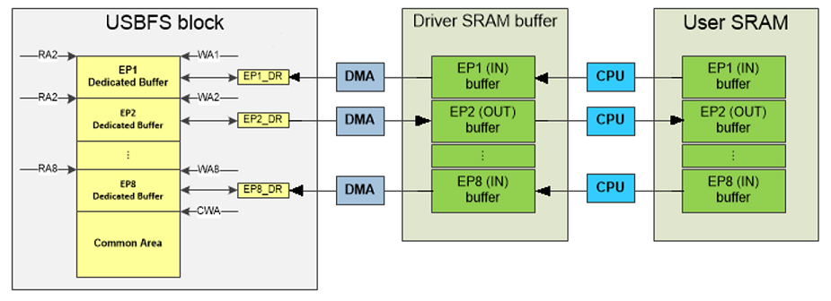

5. Observe the parameters within the configuration fields of the UART Peripheral. The UART block will be used to receive data from the USB block via DMA channels and echo it back to the USB block via DMA channels. The UART Tx and Rx pins are connected on the board physically. The UART is initialized with the following settings:

   - Baud rate: 115200
   - Data width: 8 bits
   - Parity: None
   - Stop bit: 1
   - RX Trigger Output: DMAC Channel 1 tr_in
   - TX Trigger Output: DMAC Channel 0 tr_in
   - RX FIFO Level: 7
   - TX FIFO Level: 15

   Setting RX FIFO Level to 7 (RX FIFO level range is 0-15) means that RX Trigger Output is active once RX FIFO has eight or more data elements. Later, this will be used to trigger the DMA data transfer from UART Rx FIFO to user SRAM RX Ping Pong buffers.

   TX FIFO is also set to 15 (TX FIFO level range is 0-15) in which it will TX Trigger Output will remain active while TX FIFO has 15 or fewer data elements.

**Figure 6. SCB0 UART configuration using Device Configurator**

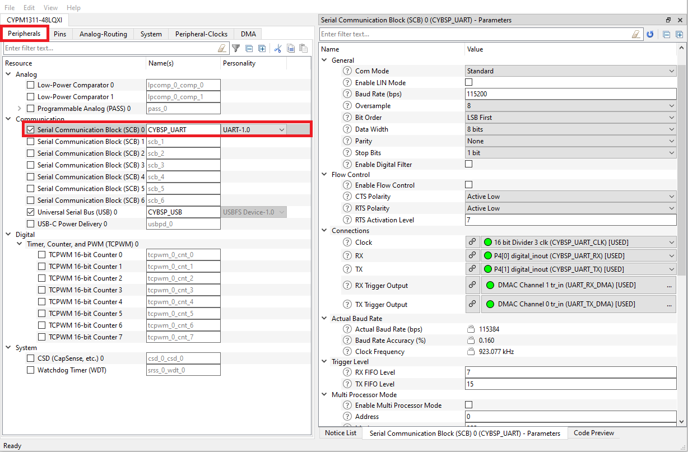

6. Lastly, navigate to the **DMA** tab of the Device Configurator window. PMG1-S3 has 16 DMA channels which can be enabled or configured within the Device Configurator. 

   Recall that this application uses four DMA channels for data transfer from peripheral to peripheral. Two of these channels do not have to be configured in this DMA tab as they are automatically configured once the **Endpoint Buffer Management** parameter is set to **Automatic DMA** in the USB Peripheral within Device Configurator. These channels are TX_DMA_USB_EP2 (DMA Channel 9) and TX_DMA_USBV_EP3 (DMA Channel 10). 

   Only DMA channels UART_TX_DMA (DMA Channel 0) and UART_RX_DMA (DMA Channel 1) need to be explicitly configured as shown in Figure 7 and Figure 8 shown below.

   UART_TX_DMA (DMA Channel 0) resource as shown in Figure 7, handles the data transfer in the receive direction. UART_TX_DMA has only a single Descriptor which is Ping, this DMA channel will transfer up to 16 data elements and be invalidated upon completion. Meaning it must be re-validated else the channel will be disabled, this helps in maintaining proper handshaking i.e., re-validate and enable the channel when data is ready to be transferred. This channel transfers data from the user TX SRAM buffer to the UART TX FIFO.

**Figure 7. DMA Channel 0 configuration using Device Configurator**

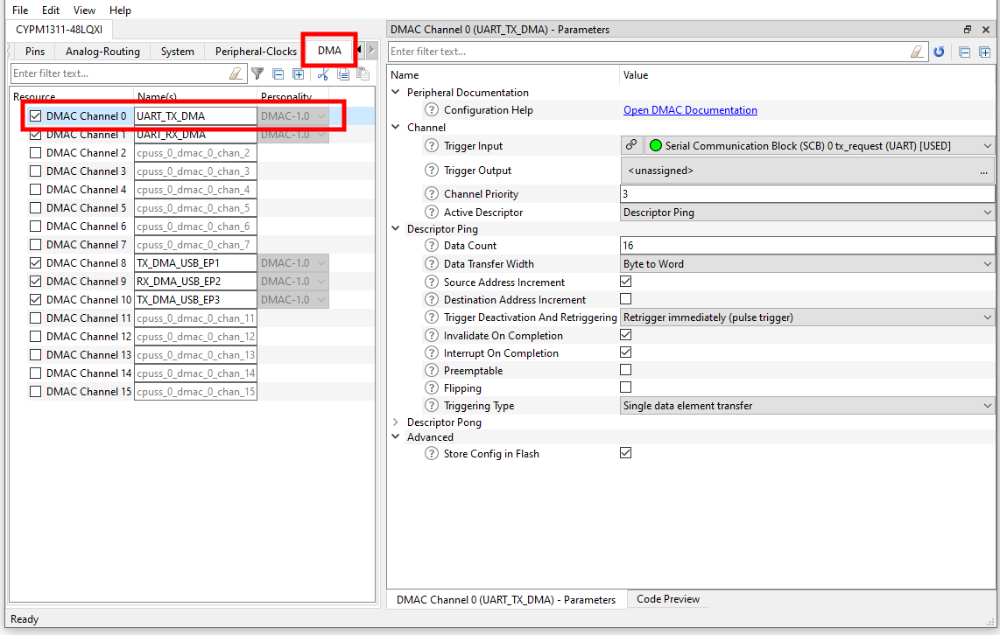

UART_RX_DMA (DMA Channel 1) resource as shown in Figure 8, handles the data transfer in the transmit direction. UART_TX_DMA has two descriptors which are Ping and Pong. After successful data transfer the active descriptor will toggle between the two, i.e. if the Ping descriptor finished transferring data the active descriptor will now be Pong. This channel transfers data from the UART RX FIFO to the user RX SRAM ping pong buffers. 

**Figure 8. DMA Channel 1 configuration using Device Configurator**

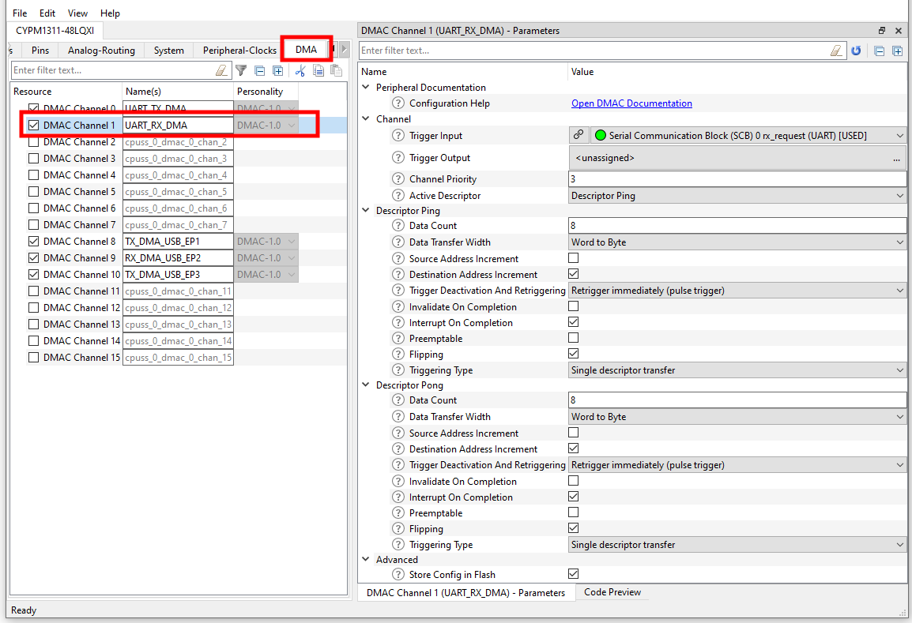


### USB configuration

Do the following to view the CDC descriptor:

1. Select the application project in Project Explorer.

2. In the **Quick Panel**, navigate to the **Tools** section, and click **USB Configurator 2.5**.

3. After the USB Configurator opens, see the following figures for some important Descriptor Configurations.

   Device Descriptor field **bDeviceClass** names a class that the device/kit belongs to. A value of 0x02 indicates that the device/kit is a communications device. In addition, two endpoint descriptors are added which act as buffers storing the received data or data waiting to be transmitted. An important field in these endpoint descriptors is **bEndpointAddress(7):direction**. One endpoint is defined as IN and provides the data to send to the host while another endpoint is defined as OUT and stores data received from the host.

   Another important endpoint descriptor is **wMaxPacketSize**, which specifies the max number of data bytes the endpoint can transfer in a transaction. For this example, because the UART FIFO has a max capacity of 16 bytes, **wMaxPacketSize** is set to 16 bytes to avoid issues with overflow.

**Figure 9. USB CDC device descriptor**

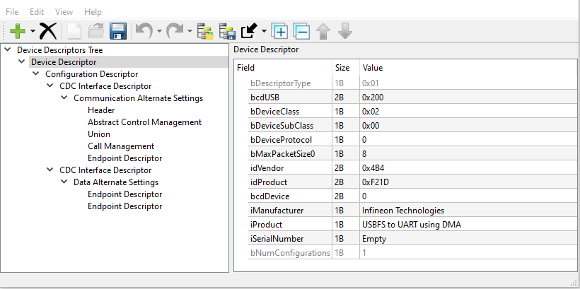

**Figure 10. USB CDC IN data endpoint 2 descriptor**

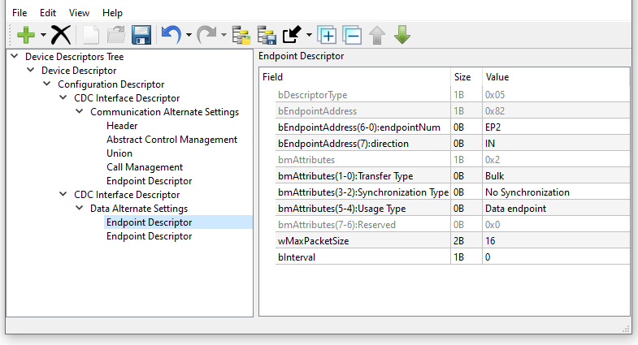

**Figure 11. USB CDC OUT data endpoint 3 descriptor**

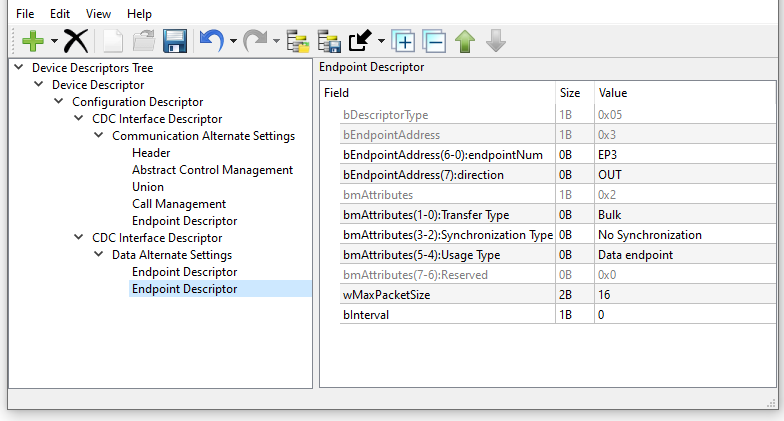

### Firmware Flow

Figure 12 shows the firmware flowchart for the design.

In the main firmware routine, the USB device block is configured to use the CDC.  Following that, DMA channels (UART_TX_DMA, UART_RX_DMA) are configured, both of which transfer data to/from the UART peripheral to the user SRAM Tx and Rx buffers. Only these DMA channels are explicitly needed to be configured in firmware as the DMA channels between the USBFS block and the Driver SRAM buffers (TX_DMA_USB_EP3, RX_DMA_USB_EP2, TX_DMA_USB_EP1) are automatically configured once the **Endpoint Buffer Management** parameter is set to **Automatic DMA** in Device Configurator.

All DMA data transfers are handled and initiated within the Interrupt Service Routines of the DMA and UART blocks.
After enumeration, the device is constantly checking if any error flags are raised during DMA data transfer, in which case an error handler will be called.

**Figure 12. Firmware flowchart**

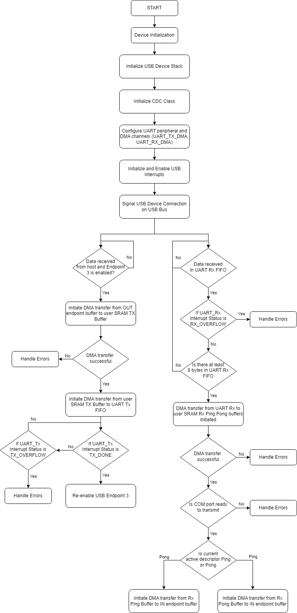

### Resources and settings

**Table 1. Application resources**

Resource  |  Alias/object     |    Purpose
:------- | :------------    | :------------
USB | CYBSP_USB  | USB device configured with CDC mouse descriptor
SCB (UART) | CYBSP_UART | Echoing the data transfer from UART TX to UART RX
DMA | UART_TX_DMA | Data Transfer
DMA | UART_RX_DMA | Data Transfer
DMA | RX_DMA_USB_EP2 | Data Transfer
DMA | TX_DMA_USB_EP3 | Data Transfer


<br>

## Related resources

Resources | Links
-----------|------------------
Application notes |[AN232553](https://www.infineon.com/AN232553) – Getting started with EZ-PD&trade; PMG1 MCU on ModusToolbox&trade; software <br> [AN232565](https://www.infineon.com/AN232565) – EZ-PD&trade; PMG1 MCU hardware design guidelines and checklist
Code examples | [Using ModusToolbox&trade; software](https://github.com/Infineon/Code-Examples-for-ModusToolbox-Software) on GitHub
Device documentation | [EZ-PD&trade; PMG1 datasheets](https://www.infineon.com/cms/en/product/universal-serial-bus/usb-c-high-voltage-microcontrollers/)
Development kits | Select your kits from the [evaluation board finder](https://www.infineon.com/cms/en/design-support/finder-selection-tools/product-finder/evaluation-board)
Libraries on GitHub | [mtb-pdl-cat2](https://github.com/Infineon/mtb-pdl-cat2) – Peripheral Driver Library (PDL) and docs
Tools | [Eclipse IDE for ModusToolbox&trade; software](https://www.infineon.com/modustoolbox) – ModusToolbox&trade; software is a collection of easy-to-use software and tools enabling rapid development with Infineon MCUs, covering applications from embedded sense and control to wireless and cloud-connected systems using AIROC™ Wi-Fi & Bluetooth® combo devices.

## Other resources

Infineon provides a wealth of data at www.infineon.com to help you select the right device, and quickly and effectively integrate it into your design.

## Document history

Document title: *CE236900* – *EZ-PD&trade; PMG1 MCU: USB to UART using DMA*

Version | Description of change
------- | ---------------------
1.0.0   | New code example


<br>

---------------------------------------------------------

© Cypress Semiconductor Corporation, 2023. This document is the property of Cypress Semiconductor Corporation, an Infineon Technologies company, and its affiliates ("Cypress").  This document, including any software or firmware included or referenced in this document ("Software"), is owned by Cypress under the intellectual property laws and treaties of the United States and other countries worldwide.  Cypress reserves all rights under such laws and treaties and does not, except as specifically stated in this paragraph, grant any license under its patents, copyrights, trademarks, or other intellectual property rights.  If the Software is not accompanied by a license agreement and you do not otherwise have a written agreement with Cypress governing the use of the Software, then Cypress hereby grants you a personal, non-exclusive, nontransferable license (without the right to sublicense) (1) under its copyright rights in the Software (a) for Software provided in source code form, to modify and reproduce the Software solely for use with Cypress hardware products, only internally within your organization, and (b) to distribute the Software in binary code form externally to end users (either directly or indirectly through resellers and distributors), solely for use on Cypress hardware product units, and (2) under those claims of Cypress’s patents that are infringed by the Software (as provided by Cypress, unmodified) to make, use, distribute, and import the Software solely for use with Cypress hardware products.  Any other use, reproduction, modification, translation, or compilation of the Software is prohibited.
<br>
TO THE EXTENT PERMITTED BY APPLICABLE LAW, CYPRESS MAKES NO WARRANTY OF ANY KIND, EXPRESS OR IMPLIED, WITH REGARD TO THIS DOCUMENT OR ANY SOFTWARE OR ACCOMPANYING HARDWARE, INCLUDING, BUT NOT LIMITED TO, THE IMPLIED WARRANTIES OF MERCHANTABILITY AND FITNESS FOR A PARTICULAR PURPOSE.  No computing device can be absolutely secure.  Therefore, despite security measures implemented in Cypress hardware or software products, Cypress shall have no liability arising out of any security breach, such as unauthorized access to or use of a Cypress product. CYPRESS DOES NOT REPRESENT, WARRANT, OR GUARANTEE THAT CYPRESS PRODUCTS, OR SYSTEMS CREATED USING CYPRESS PRODUCTS, WILL BE FREE FROM CORRUPTION, ATTACK, VIRUSES, INTERFERENCE, HACKING, DATA LOSS OR THEFT, OR OTHER SECURITY INTRUSION (collectively, "Security Breach").  Cypress disclaims any liability relating to any Security Breach, and you shall and hereby do release Cypress from any claim, damage, or other liability arising from any Security Breach.  In addition, the products described in these materials may contain design defects or errors known as errata which may cause the product to deviate from published specifications. To the extent permitted by applicable law, Cypress reserves the right to make changes to this document without further notice. Cypress does not assume any liability arising out of the application or use of any product or circuit described in this document. Any information provided in this document, including any sample design information or programming code, is provided only for reference purposes.  It is the responsibility of the user of this document to properly design, program, and test the functionality and safety of any application made of this information and any resulting product.  "High-Risk Device" means any device or system whose failure could cause personal injury, death, or property damage.  Examples of High-Risk Devices are weapons, nuclear installations, surgical implants, and other medical devices.  "Critical Component" means any component of a High-Risk Device whose failure to perform can be reasonably expected to cause, directly or indirectly, the failure of the High-Risk Device, or to affect its safety or effectiveness.  Cypress is not liable, in whole or in part, and you shall and hereby do release Cypress from any claim, damage, or other liability arising from any use of a Cypress product as a Critical Component in a High-Risk Device. You shall indemnify and hold Cypress, including its affiliates, and its directors, officers, employees, agents, distributors, and assigns harmless from and against all claims, costs, damages, and expenses, arising out of any claim, including claims for product liability, personal injury or death, or property damage arising from any use of a Cypress product as a Critical Component in a High-Risk Device. Cypress products are not intended or authorized for use as a Critical Component in any High-Risk Device except to the limited extent that (i) Cypress’s published data sheet for the product explicitly states Cypress has qualified the product for use in a specific High-Risk Device, or (ii) Cypress has given you advance written authorization to use the product as a Critical Component in the specific High-Risk Device and you have signed a separate indemnification agreement.
<br>
Cypress, the Cypress logo, and combinations thereof, WICED, ModusToolbox, PSoC, CapSense, EZ-USB, F-RAM, and Traveo are trademarks or registered trademarks of Cypress or a subsidiary of Cypress in the United States or in other countries. For a more complete list of Cypress trademarks, visit www.infineon.com. Other names and brands may be claimed as property of their respective owners.
